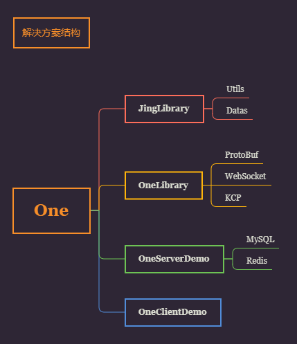

# One

> C#代码开发 基于.net core的服务器游戏框架。特点是简单易上手，方便自定义扩展

### 通信协议解决方案  
- TCP: WebSocket协议

> 未来计划使用增加UDP协议的解决方案KCP

### 数据序列化解决方案
- ProtoBuf
- Json

### 数据持久化解决方案
- Redis
- MySQL

### 项目解决方案简介

#### JingLibrary
One作者Jing的基础代码库,目标框架.net Standard 2.0

#### OneLibrary
One代码库，目标框架.net Standard 2.0。 含有通信内容的封装，基于C#开发的前后端都可以使用（兼容Unity)
- 逻辑代码架构
- 协议处理架构

#### ClientDemo
客户端Demo

#### ServerDemo
服务端Demo

